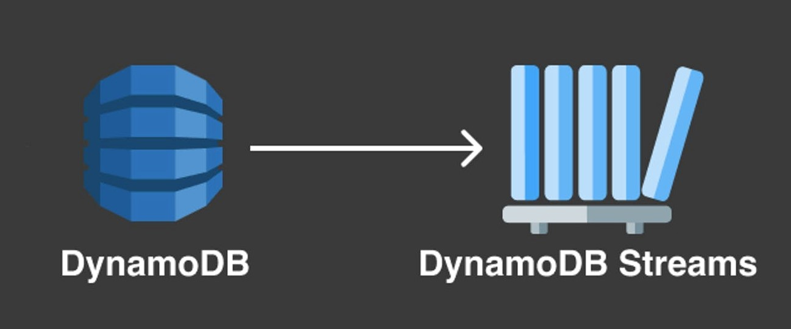

<div id="top"></div>
<!--
*** Thanks for checking out the Best-README-Template. If you have a suggestion
*** that would make this better, please fork the repo and create a pull request
*** or simply open an issue with the tag "enhancement".
*** Don't forget to give the project a star!
*** Thanks again! Now go create something AMAZING! :D
-->


<!-- PROJECT SHIELDS -->
<!--
*** I'm using markdown "reference style" links for readability.
*** Reference links are enclosed in brackets [ ] instead of parentheses ( ).
*** See the bottom of this document for the declaration of the reference variables
*** for contributors-url, forks-url, etc. This is an optional, concise syntax you may use.
*** https://www.markdownguide.org/basic-syntax/#reference-style-links
-->
[![Contributors][contributors-shield]][contributors-url]
[![Forks][forks-shield]][forks-url]
[![Stargazers][stars-shield]][stars-url]
[![Issues][issues-shield]][issues-url]
[![MIT License][license-shield]][license-url]
[![LinkedIn][linkedin-shield]][linkedin-url]


<!-- PROJECT LOGO -->
<br />
<div align="center">
  <a href="https://github.com/viruskizz/dynamodb-stream-example">
    
  </a>

<h3 align="center">AWS DynamoDB Stream Example</h3>
  <p align="center">
    Real time trigger with AWS DynamoDB on Serverless Framework
  </p>
</div>


<!-- TABLE OF CONTENTS -->
<details>
  <summary>Table of Contents</summary>
  <ol>
    <li>
      <a href="#about-the-project">About The Project</a>
    </li>
    <li>
      <a href="#getting-started">Getting Started</a>
      <ul>
        <li><a href="#prerequisites">Prerequisites</a></li>
        <li><a href="#installation">Installation</a></li>
      </ul>
    </li>
    <li><a href="#usage">Usage</a></li>
    <li><a href="#license">License</a></li>
    <li><a href="#contact">Contact</a></li>
    <li><a href="#acknowledgments">Acknowledgments</a></li>
  </ol>
</details>


<!-- ABOUT THE PROJECT -->
## About The Project

[![Product Name Screen Shot][product-screenshot]](https://example.com)

This project will show you about basic AWS DynamoDB Stream. You will know how to use them and benefit of Stream.
If you don't have any AWS knowledge background, you should learn it first from Acknowledge section on footer of this page.


<!-- GETTING STARTED -->
## Getting Started

This project example is about customer payment.The system have to log payment data to table and calculate real-time summary report that is backed up in table After Payment data is written on table,

### Prerequisites

1. This project running by [NodeJS](https://nodejs.org/en/).
2. User need AWS Account. [Signup from this link](https://aws.amazon.com/)
3. Create the three DynamoDB table for Payment Logging and Report
4. create stream at Payment table
5. install serverless framework on local environment. [Follow this instruction](https://www.serverless.com/framework/docs/providers/aws/guide/quick-start)


### Installation

1. Clone the repo
   ```sh
   git clone https://github.com/viruskizz/dynamodb-stream-example
   ```
2. Install NPM packages
   ```sh
   npm install
   ```
3. Setup Project environment by copy `example.env` to `.env`
   ```dotenv
    ACCOUNT_ID=<account_id>
    STREAM_ARN=<stream_amazon_resource_name>
    REGION=<region_code>
    PAYMENT_TABLE=<payment_table_name>
    REPORT_TABLE=<report_table_namme>
    LOGGING_TABLE=<log_table_name>
    ```

<!-- USAGE EXAMPLES -->
## Usage

1. test this project
    ```sh
    npm run test
    ```
2. deploy the AWS Resource
    ```sh
    serverless deploy
    ```

<!-- LICENSE -->
## License

Distributed under the MIT License. See `LICENSE.txt` for more information.

<p align="right">(<a href="#top">back to top</a>)</p>


<!-- CONTACT -->
## Contact

Thitiwut Somsa - [@viruskizz](https://twitter.com/viruskizz) - kizzaraiva@gmail.com

Project Link: [https://github.com/viruskizz/dynamodb-stream-example](https://github.com/viruskizz/dynamodb-stream-example)


<!-- ACKNOWLEDGMENTS -->
## Acknowledgments

the acknowledgement is related with this project.
* [AWS Lambda](https://aws.amazon.com/lambda/)
* [AWS DynamoDB](https://aws.amazon.com/dynamodb)
* [DevOps on AWS](https://aws.amazon.com/devops/)
* [Serverless Framework](https://www.serverless.com/)
* [Jest Javascript Test Framework](https://jestjs.io/)

<p align="right">(<a href="#top">back to top</a>)</p>


<!-- MARKDOWN LINKS & IMAGES -->
<!-- https://www.markdownguide.org/basic-syntax/#reference-style-links -->
[contributors-shield]: https://img.shields.io/github/contributors/viruskizz/dynamodb-stream-example.svg?style=for-the-badge
[contributors-url]: https://github.com/viruskizz/dynamodb-stream-example/graphs/contributors
[forks-shield]: https://img.shields.io/github/forks/viruskizz/dynamodb-stream-example.svg?style=for-the-badge
[forks-url]: https://github.com/viruskizz/dynamodb-stream-example/network/members
[stars-shield]: https://img.shields.io/github/stars/viruskizz/dynamodb-stream-example.svg?style=for-the-badge
[stars-url]: https://github.com/viruskizz/dynamodb-stream-example/stargazers
[issues-shield]: https://img.shields.io/github/issues/viruskizz/dynamodb-stream-example.svg?style=for-the-badge
[issues-url]: https://github.com/viruskizz/dynamodb-stream-example/issues
[license-shield]: https://img.shields.io/github/license/viruskizz/dynamodb-stream-example.svg?style=for-the-badge
[license-url]: https://github.com/viruskizz/dynamodb-stream-example/blob/main/LICENSE.txt
[linkedin-shield]: https://img.shields.io/badge/-LinkedIn-black.svg?style=for-the-badge&logo=linkedin&colorB=555
[linkedin-url]: https://www.linkedin.com/in/thitiwut-somsa-7b3210127/
[product-screenshot]: docs/project-architect.png
